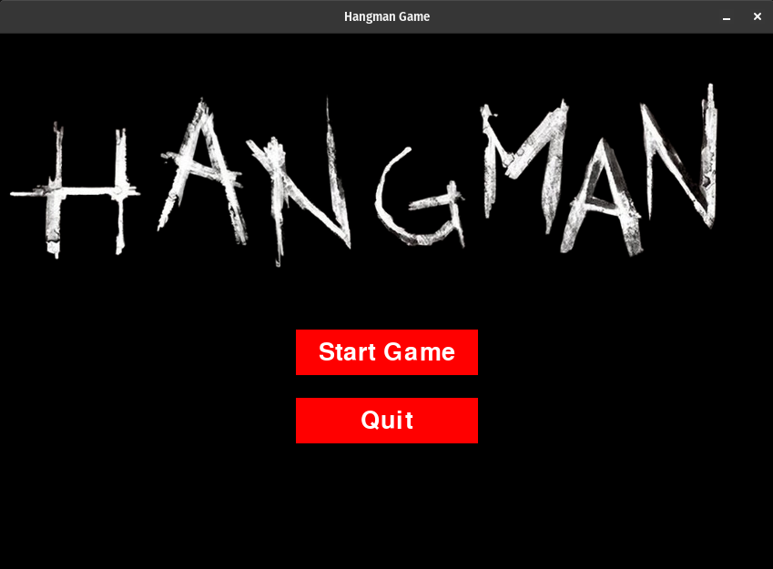
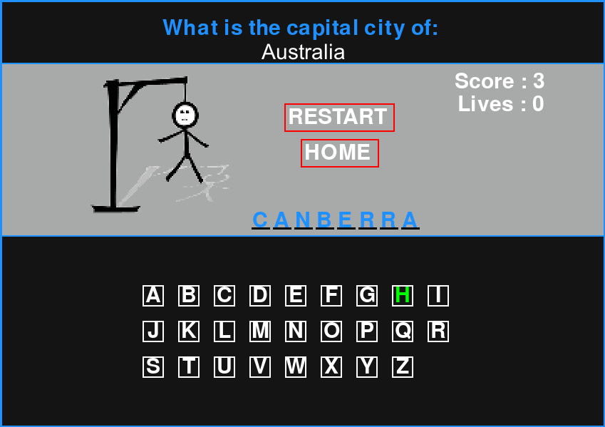

# Hangman Game with Pygame




This is a simple Hangman game implemented in Python using the Pygame library. Test your GK by playing Hangman .

## Features

- Dzongkha background music and sound effect
- Randomly selected words for each game.
- Interactive user interface.
- Score tracking.
- lives tracking

## Installation

1. Clone this repository:

   ```bash
   git clone https://github.com/tsheringphuntsho18/CAP2_Pygame.git

# How to play
- Start by running game.py
- Guess the hidden capital city
- Try to guess the hidden word before the hangman is fully drawn

# Contribution
Contributions are welcome, if you'd like to contribute to this project, please follow these
guidelines:
1. Fork the respository
2. Create a new branch for your feature or bug fix
3. Make your changes and commit them
4. Submit a pull request with a clear description of your changes


